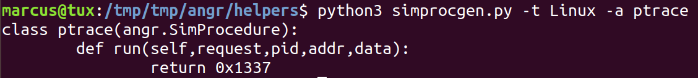
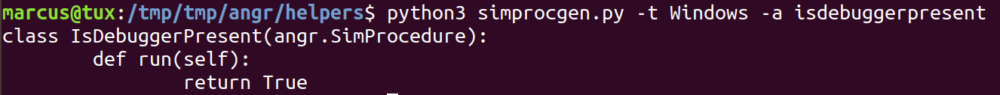
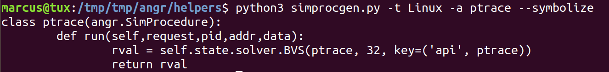
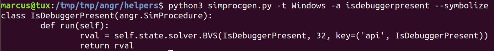

# Helper: Simprocedure Generator (Simprocgen)

Generates a simprocedure for a given API function.

## Usage

Specify an OS and a function name and the script will do everything for you!

Either for Linux:

Or for Windows:

Alternatively, you can specify flags to automatically generates a symbolic variable as the function return;

For Linux:

For Windows:

