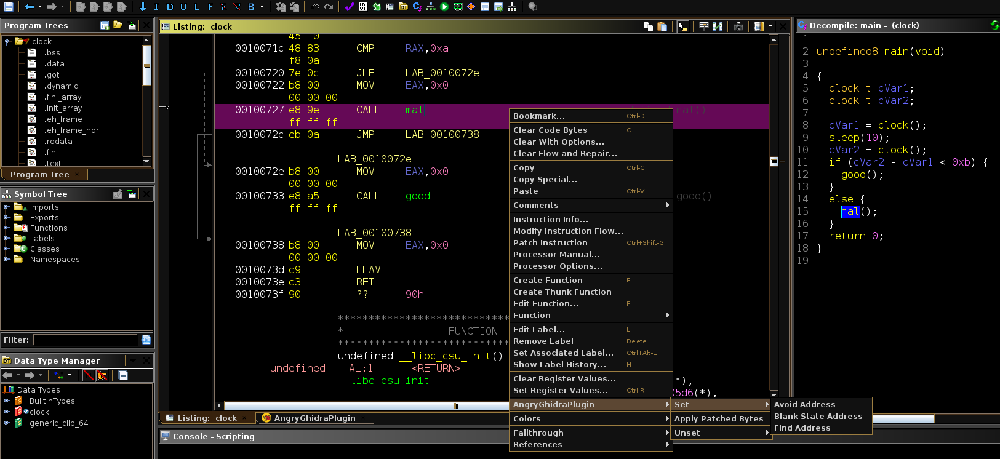
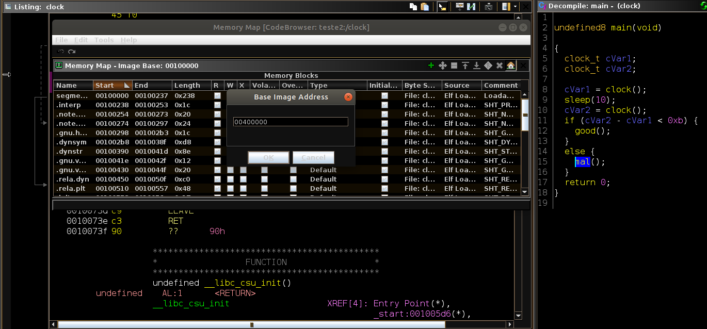
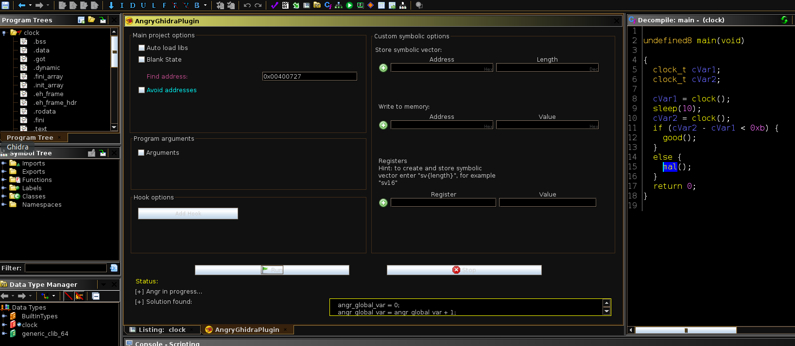

# Ghidra Integration

I adapted the [AngryGhidra plugin](https://github.com/Nalen98/AngryGhidra) to work with MalVerse.

## Installation

* Clone [my AngryGhidra](https://github.com/marcusbotacin/AngryGhidra)
* Build it as usual.
* Or directly replace the python script in the Ghidra plugin directory.

## Usage

Use the context menu to indicate where the execution flow must go to.

Notice that to integrate ghidra with angr they must use the same base address, so specify it in the memory map window.

After you run it, the MalVerse output is displayed in the textbox. (OK, this is not the ideal world, we need to change that for the future).

