# MalVerse Tests

MalVerse application to Logic Bombs. Just type *make* for a test case and watch!

## GetPid

The application in the following example only triggers a malicious path if a given *PID* is returned.

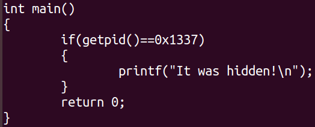

If we decompile the *getpid* function with *angr*, it only generates a jump to an external address (the function implementation), since the *getpid* symbol only refers to a jump table location.

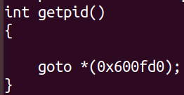

However, in this example, we are not interested in the actual *getpid* implementation, but only in the value that it should return in this specific context, thus MalVerse must ignore the jump and considers the concrete value.

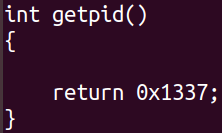

When we run the application, we notice that the expected *PID* is not returned by chance in most cases, thus the malicious path is not reached.

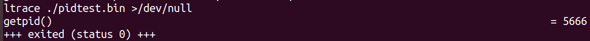

When patched with MalVerse-generated code, it invokes the function in the malicious path.

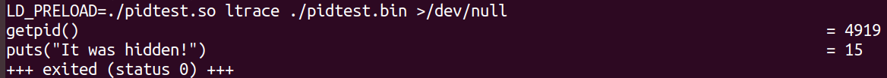

## Time

Similarly, in this example, the application is only triggered in an specific time.

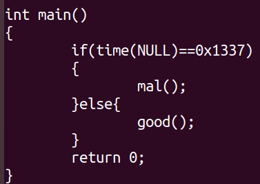

We can generate a patch to always trigger it by using MalVerse.

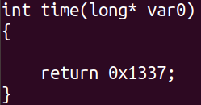

The difference in the execution with and without the patch is following illustrated.

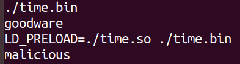

## Ptrace

In this example, the application checks if a debugger is already attached via the *ptrace* call. In this case, the code is only displayed if a debugger is attached. It might correspond, for instance, to an evasive function.

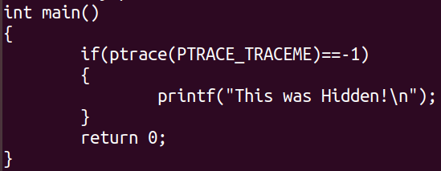

If we decompile the *ptrace* function using *angr*, we only get a jump to an external address.

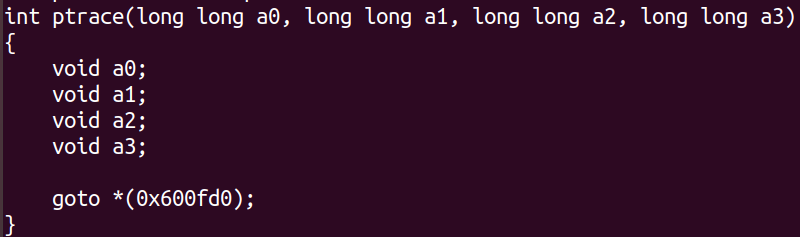

However, by using MalVerse, we can create a patch that returns the exact value expected by the application, without calling the original function.

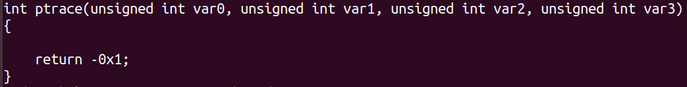

Thus, even executing the application without a debugger, it reaches the targeted path.

## DebugMeNot

This is a very famous anti-debug trick. Check it [here](https://github.com/kirschju/debugmenot). MalVerse suggests that for its successful operation we should patch two functions:

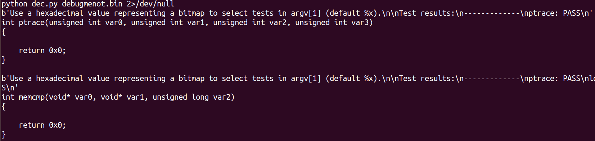

When we trace the original binary, it detects the hook and fails. However, when we execute the patched version, it successfully passes the check.

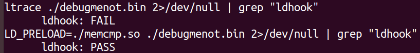

## Double Ptrace

In this example, the application also tries to avoid detection via the *ptrace* check. However, it also protects itself from being subverted from a patched *ptrace* call. For such, it attempts to attach *ptrace* twice. When running in a real debugger, it is expected to fail in the first check, as *ptrace* will be already attached by the debugger. If running with a traditionally patched library, it is supposed to fail in the second check, as a succesfull call in the first check should never allow the flow to reach this second path. In a real machine, the third path is reached, thus exhibiting the malicious behavior.

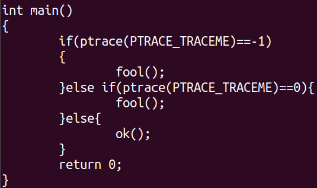

Therefore, MalVerse generates a patch that is aware of the number of invocations of the *ptrace* function, returning distinct values according to them.

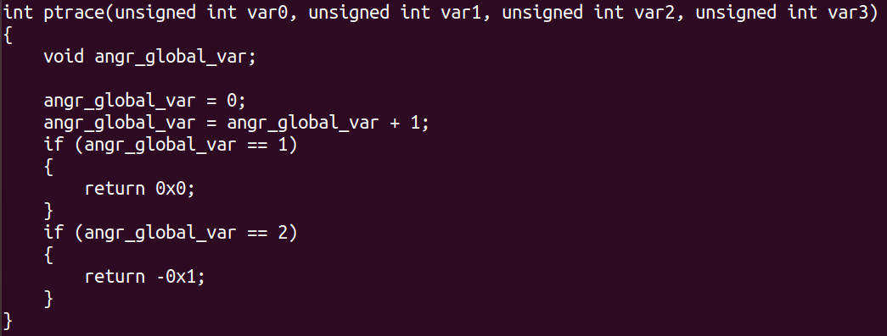

It allows the application to always reach the third case, regardless of any actual *ptrace* invocation.

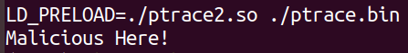

## Clock

In this example, the application has a stalling code technique to wait some time before its execution. It aims to cause a timeout in sandbox executions. However, in addition to a logic bomb that is fired only after some time, the application protects itself from subversion from an application that does not wait such amount of time by checking the number of clock ticks spent by the function call.

In this case, MalVerse must generates a patch that return distinct values for each invocation of the clock function.

We notice that: (i) in the first case, the malicious behavior is displayed, but it takes time, which might suffice for a sandbox timeout; (ii) when the sleep function is patched to immediately return, the application detects the misbehavior and exhibits a benign behavior; and (iii) when the application is patched with our MalVerse payload, it presents the malicious behavior without waiting.

## CWD

In this example, the application only exhibits the malicious behavior when running from a given specific path.

The patch to it requires the function to return a pointer to a variable instead to an immediate value.

To provide a valid pointer, MalVerse generates a patch that preloads the main function to allocates the buffer and creates a global variable to the whole program context. Thus, the patched specific function might only return the address of this global  variable.

We notice that: (i) when we run the original application, it is not malicious; but (ii) when it is patched, it displays its malicious behavior without crashing.

## Visualizing the differences

Once one identifies the impact of distinct function returns over a binary behavior, such difference can be visualized by aligning the history of invoked functions and concretizing their values according to the distinct states.

We following observe an example of an execution flow that branches according to the distinct returns of the *strcmp* function.

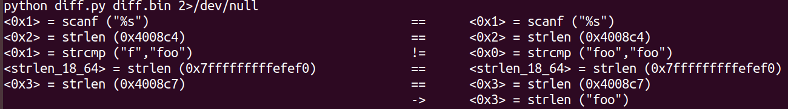

If one follows the flow a little bit, he/she notices that the right path has an additional comparison.

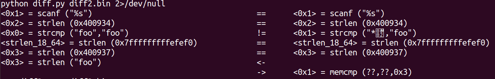

In fact, both paths might present distinct function invocations after a function call return diverged.

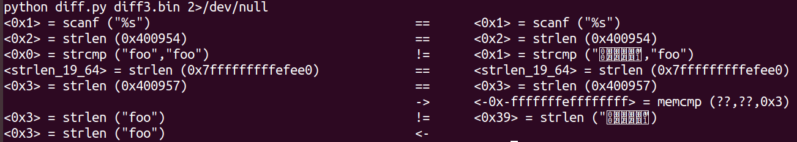
