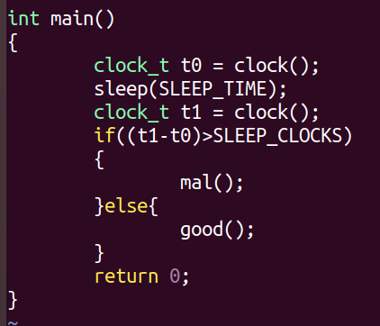
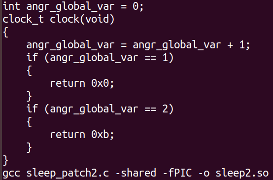
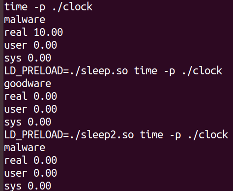
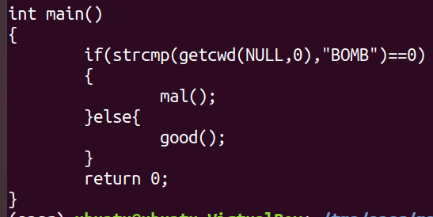
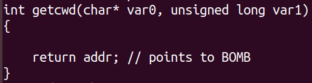
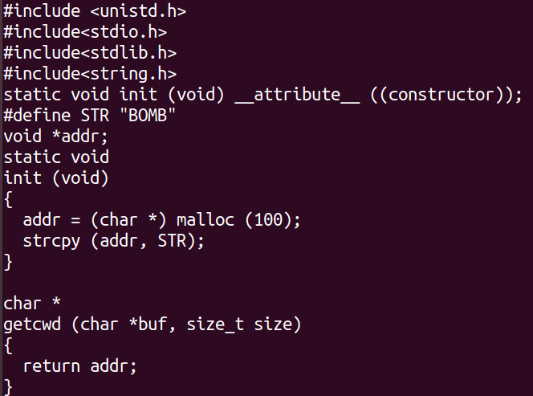
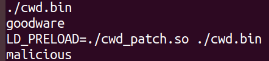

# MalVerse Tests

MalVerse application to Logic Bombs. Just type *make* for a test case and watch!

## Clock

In this example, the application has a stalling code technique to wait some time before its execution. It aims to cause a timeout in sandbox executions. However, in addition to a logic bomb that is fired only after some time, the application protects itself from subversion from an application that does not wait such amount of time by checking the number of clock ticks spent by the function call.

In this case, MalVerse must generates a patch that return distinct values for each invocation of the clock function.

We notice that: (i) in the first case, the malicious behavior is displayed, but it takes time, which might suffice for a sandbox timeout; (ii) when the sleep function is patched to immediately return, the application detects the misbehavior and exhibits a benign behavior; and (iii) when the application is patched with our MalVerse payload, it presents the malicious behavior without waiting.

## CWD

In this example, the application only exhibits the malicious behavior when running from a given specific path.

The patch to it requires the function to return a pointer to a variable instead to an immediate value.

To provide a valid pointer, MalVerse generates a patch that preloads the main function to allocates the buffer and creates a global variable to the whole program context. Thus, the patched specific function might only return the address of this global  variable.

We notice that: (i) when we run the original application, it is not malicious; but (ii) when it is patched, it displays its malicious behavior without crashing.

